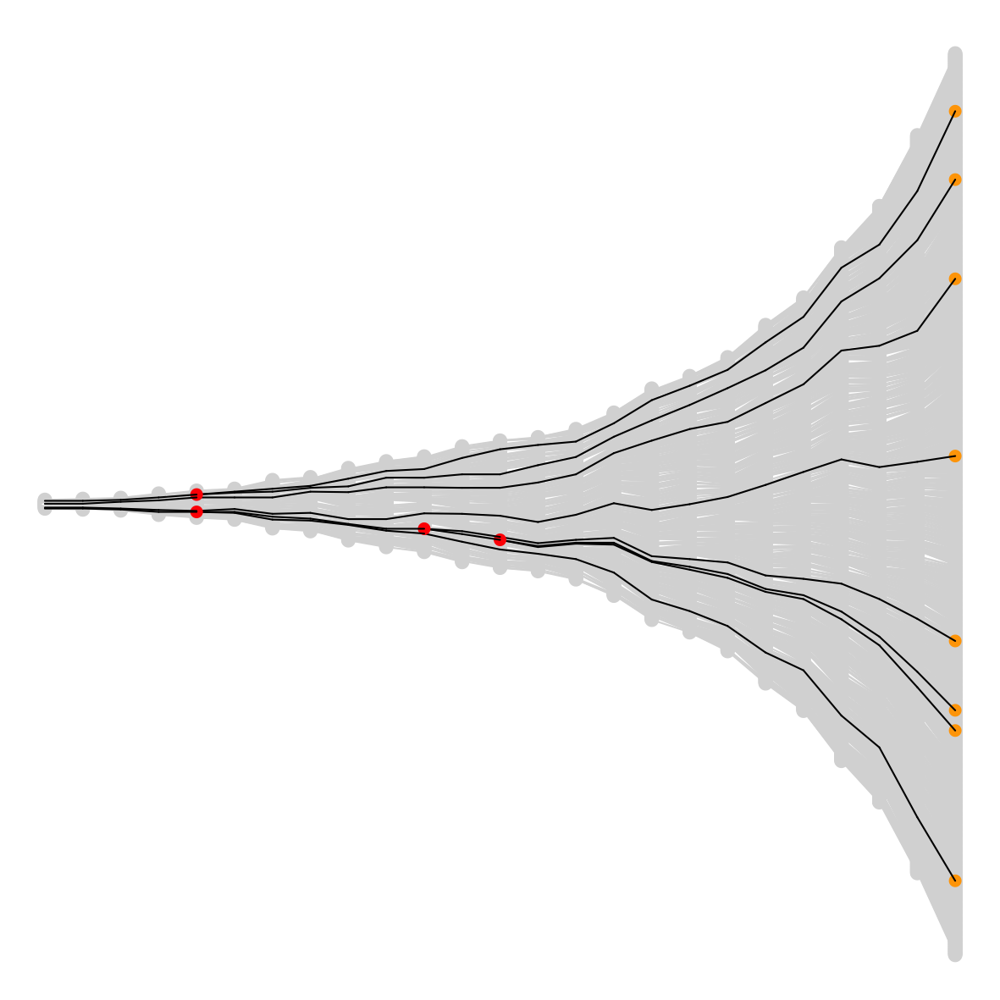
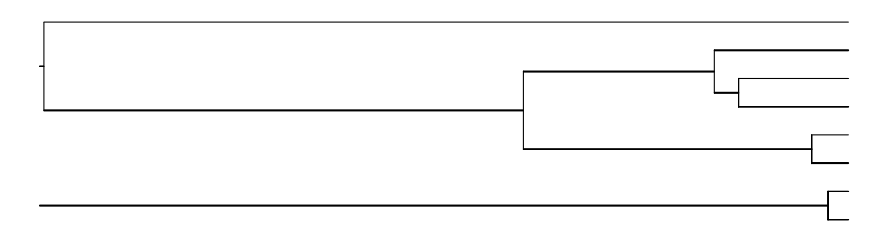

Zamin Iqbal asked on [BlueSky](https://bsky.app/profile/zaminiqbal.bsky.social/post/3kewembn3fg2s
) about figures related to tree shape depending on population growth. I needed a figure as well so coded [this](scripts/). 

-  Exponential growth

  

-  Constant population size

  

(The size of the population is the average size of the population under exponential growth)
